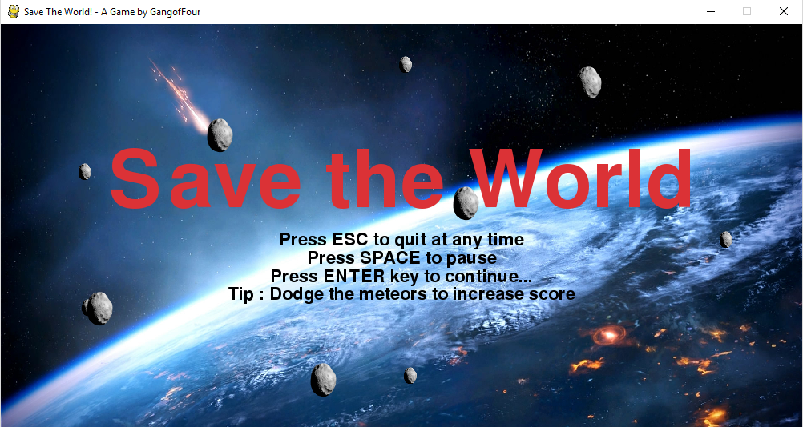

## Save The World 🎲

**A game made during [Hack 2.0] conducted at NIT Hamirpur.**

This is an arcade game in which you have to dodge the meteors coming towards you.

Longer you can dodge, more will be the score.

### Requirements
This game requires [Python 3] and [Pygame] to run.

Just get the latest version.

### How to run the game?
Download the zip of game by clicking on **Clone or download**. 

Extract zip file.

**On Windows** 

It's as simple as clicking on "Save the world.py"

### Screenshots

 Made with ❤ by <a href="https://hack2nith.hackerearth.com/sprints/hack-20/dashboard/15f7a6c/team/">Gang of Four </a>

[Hack 2.0]: https://hack2nith.hackerearth.com/ "HACK 2.0 Website"
[Python 3]: https://www.python.org/
[Pygame]: https://www.pygame.org/
